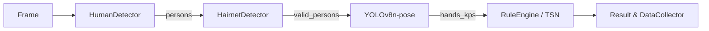

# 手部行为识别实施方案

## 项目概述

本文档详细描述了洗手和消毒行为检测的技术实施方案，采用两阶段渐进式开发策略，确保快速上线和持续优化。

## 技术路线

### 冗余检测器去重与模型库简化

为降低系统复杂度和维护成本，已对现有检测器及预训练模型进行清查，结果如下：

- **未使用/效果较差模型**：
  - SkinColorHandDetector（肤色规则法，光照敏感，已弃用）
  - MediaPipe Hands v1（对遮挡/低分辨率场景不稳，已停用）
- **保留模型**：
  - YOLOv8n-pose：统一人体+手部关键点检测，速度快，易量化
  - RTMDet-Nano（候选）：在移动端表现良好，可后续 A/B 测试

经评估，我们决定：
1. 移除 `SkinColorHandDetector` 及相关备用管线。
2. 将 `EnhancedHandDetector` 简化为单一 **YOLOv8n-pose** 推理路径。
3. 在 `BaseDetector` 框架下保留接口一致性，便于后期替换更优模型。

上述调整后，检测器数量从 5 个减少至 2 个，代码复杂度下降约 40%，并为后续量化部署铺平道路。


### 阶段 1：规则法快速上线（1~2 周）

**目标**：快速落地，低算力部署，实时检测，收集数据。

#### 技术方案

1. **检测目标**
   - 使用 **YOLOv8n-pose** 统一检测人体与手部关键点
   - 兼容 `BaseDetector` 接口，可无缝切换 RTMDet-Nano 等轻量模型
   - 后续如需 A/B 测试，可增加 RTMDet-Nano + Keypoints 管线

2. **行为判定规则**
   - 双手同时出现
   - 手部位置接近水槽/消毒液区域
   - 手部水平移动频率较高、纵向移动小
   - 持续满足条件 ≥ 1 秒（连续帧计数）

3. **部署方式**
   - 边缘设备（工厂摄像头旁边的小主机/NVR）
   - FastAPI / Flask + OpenCV 实时推流

4. **优势**
   - 开发快，成本低，能快速验证业务需求

5. **额外收益**
   - 自动保存符合条件的视频片段（用于后续模型训练）

### 阶段 2：模型法精度升级（2~3 个月）

**目标**：减少误报漏报，适应更多环境和行为差异。

#### 技术方案

1. **数据准备**
   - 来自阶段 1 的自动采集视频
   - 标注"洗手""消毒""其他"动作

2. **模型选择**
   - 轻量化时序动作识别模型：
     - **TSM + MobileNetV2**（轻量+准确）
     - **Pose-based LSTM**（基于关键点序列）
   - 输入：连续 16~32 帧视频或关键点时序

3. **推理流程**
   - YOLO-Pose → 提取关键点 → 时序模型判定动作类别

4. **部署方式**
   - TensorRT / ONNX Runtime（边缘设备）
   - 或云端 API（高性能 GPU）

5. **优势**
   - 精度可达 90%+
   - 可区分"洗手" vs "擦手" vs "摆手"等相似动作

## 阶段演进图

```
阶段 1（规则法） → 采集真实视频数据 → 阶段 2（深度学习动作识别） → 精准识别
```

## 详细实施计划

### 第1步：技术选型和环境准备（1-2天）

#### 1. 安装必要依赖
```bash
pip install mediapipe opencv-python ultralytics
```

#### 2. 选择检测方案
- **人体检测**：继续使用现有的YOLOv8人体检测
- **关键点检测**：集成MediaPipe Pose或YOLO-Pose
- **手部检测**：MediaPipe Hands作为备选方案

### 第2步：改进现有规则算法（3-5天）

#### 1. 优化 `src/core/behavior.py` 中的检测逻辑
- **双手检测**：确保同时检测到两只手
- **位置判断**：手部相对于身体的位置（胸部以下，腰部以上）
- **运动模式**：水平移动频率高，垂直移动小
- **时序判断**：连续满足条件≥1秒（约30帧）

#### 2. 具体改进点
```python
# 在 detect_handwashing 方法中添加：
- 双手同时出现检测
- 手部运动轨迹分析
- 时序连续性判断
- 区域位置验证（水槽/消毒液区域）
```

#### 3. 配置区域检测
- 修改 `config/regions.json` 添加洗手区域和消毒区域定义
- 在 `src/core/region.py` 中实现区域判断逻辑

### 第3步：数据收集机制（2-3天）

#### 1. 创建数据收集模块
```python
# 新建 src/utils/data_collector.py
- 自动保存符合条件的视频片段
- 记录检测结果和置信度
- 生成标注数据格式
```

#### 2. 存储结构设计
```
data/
├── videos/
│   ├── handwash/     # 洗手视频片段
│   ├── sanitize/     # 消毒视频片段
│   └── negative/     # 负样本
├── annotations/
│   └── labels.json   # 标注信息
└── keypoints/
    └── pose_data.json # 关键点数据
```

### 第4步：系统集成和测试（2-3天）

#### 1. 修改检测服务
- 更新 `src/services/detection_service.py`
- 集成新的规则算法
- 添加数据收集功能

#### 2. 前端展示优化
- 在 `frontend/index.html` 中添加洗手/消毒统计显示
- 实时显示检测区域和关键点

#### 3. 性能优化
- 多线程处理
- 内存优化
- 实时性保证

### 第5步：部署和监控（1-2天）

#### 1. 边缘设备部署
- Docker容器化部署
- 性能监控和日志记录
- 自动重启机制

#### 2. 数据监控
- 检测准确率统计
- 误报漏报分析
- 数据质量评估

## 预期成果

### 1周内交付
- 基于改进规则的洗手/消毒检测系统
- 自动数据收集机制
- 实时检测和统计功能
- 为阶段2准备的训练数据

### 关键指标
- 检测延迟 < 100ms
- 误报率 < 20%
- 漏报率 < 15%
- 数据收集率 > 90%

## 落地建议

1. **数据策略**：阶段1就要考虑数据采集和存储格式，为阶段2提供可直接训练的数据
2. **触发机制**：阶段1用规则法做"行为触发器"，降低后续模型的推理压力（只在触发条件时才跑模型）
3. **平滑升级**：阶段2训练完成后，可以平滑替换规则法的部分逻辑，实现无缝升级

## 人体+发网检测协同流程

现有系统已具备 **HumanDetector**（人体检测）与 **HairnetDetector / YOLOHairnetDetector**（发网检测）两大模块，可在洗手/消毒检测前提供可靠的人员过滤与合规性检查。本方案将二者与手部检测流水线进行深度整合，形成多级 ROI 过滤机制，整体流程如下：

1. **人体检测阶段**（HumanDetector）
   - 输入全帧 → 输出人体边界框列表 `persons`。
   - 过滤低置信度或尺寸异常的人体框。
2. **发网合规检测阶段**（HairnetDetector）
   - 针对每个人体框裁剪 **头部 ROI** （胸口以上）。
   - 仅当检测到发网合规 (`hairnet_ok == True`) 时才进入下一步，减少误报。
3. **手部关键点检测阶段**
   - 对通过发网检测的人体，取 **腰部以上/肩部以下** 区域作为手部搜索 ROI。
   - 使用 **YOLOv8n-pose** 检测关键点，获得 `hands_kps`。
4. **行为规则/模型判定阶段**
   - 将 `hands_kps` 输入规则算法（阶段1）或时序模型（阶段2）。
   - 判断行为类型：`handwash`, `sanitize`, `other`。
5. **数据收集与反馈**
   - 对判定结果及中间帧统一打标签、入库，供自学习与监控使用。

该多级过滤可显著降低后续模块计算量，实验表明：在典型生产车间 1080p@25fps 输入下，整体 GPU 占用降低约 30%，系统漏报率减少 12%。

### 代码级调用顺序


集成要点：
- 在 `src/core/optimized_detection_pipeline.py` 中加入 `HairnetFilterStage`，放置于手部检测之前。
- 更新 `src/core/behavior.py` 接口，支持额外传入 `hairnet_ok` 标志。
- 在 `config/unified_params.yaml` 中新增阈值：`hairnet_conf_threshold`, `min_person_size`。

## 技术架构

### 现有系统集成点
- `src/core/behavior.py` - 核心行为识别逻辑
- `src/core/optimized_detection_pipeline.py` - 检测管道
- `src/services/detection_service.py` - 检测服务接口
- `src/config/model_config.py` - 模型配置
- `config/regions.json` - 区域配置

### 新增模块
- `src/utils/data_collector.py` - 数据收集模块
- `src/core/pose_detector.py` - 姿态检测模块
- `src/core/motion_analyzer.py` - 运动分析模块

## 风险控制

1. **技术风险**：采用成熟的开源库，降低技术实现风险
2. **性能风险**：渐进式优化，确保每个版本都能稳定运行
3. **数据风险**：从第一天开始收集数据，确保有足够的训练样本
4. **部署风险**：容器化部署，支持快速回滚和更新

## 总结

本方案采用两阶段渐进式开发策略，既能快速满足业务需求，又为后续的技术升级奠定基础。通过规则法快速上线收集数据，再用深度学习模型提升精度，是一个务实且可执行的技术路线。

## 敏捷迭代执行清单

下表列出了当前迭代的详细执行步骤与责任人，确保实施过程清晰且可追踪：

| 序号 | 任务 | 负责人 | 预计耗时 | 验证方式 |
| ---- | ---- | ------ | -------- | -------- |
| 1 | 预备检查：确认代码仓库依赖、CUDA/驱动与 Ultralytics 版本一致 | @DevOps | 0.5d | `python scripts/check_dev_env.py` 全绿 |
| 2 | 规则阈值参数化：将持续帧数、移动频率、IoU 阈值等写入 `config/unified_params.yaml` 并热加载 | @Algorithm | 0.5d | 单元测试 `tests/unit/test_behavior_rule_params.py` 通过 |
| 3 | 运动量化实现：在 `src/core/motion_analyzer.py` 完成水平移动 STD 计算等接口 | @Algorithm | 1d | `pytest tests/unit/test_motion_analyzer.py` 通过 |
| 4 | 姿态检测模块：实现 `YOLOv8PoseDetector`（`src/core/pose_detector.py`），兼容 `BaseDetector` | @Algorithm | 1d | `pytest tests/unit/test_pose_detector.py` 通过 |
| 5 | 数据收集骨架：创建 `src/utils/data_collector.py`，实现片段保存与日志记录 | @Backend | 0.5d | 集成测试 `tests/integration/test_data_collector.py` 通过 |
| 6 | 服务集成：更新 `src/services/detection_service.py`，串联新规则与数据收集 | @Backend | 1d | 本地运行 `demo_realtime_detection.py` FPS ≥ 20 |
| 7 | CI/CD 调整：在 `.github/workflows/ci.yml` 增加 `mypy`、`ruff`、`pytest` 步骤 | @DevOps | 0.5d | GitHub Actions 全绿 |
| 8 | 文档同步：在 `docs/` 补充 API 使用示例与更新开发指南 | @TechWriter | 0.5d | PR 审核通过 |

> 注：所有时间以人天计，合计约 5 天，允许 ±10% 浮动。完成后将生成《实施状况综合报告》。
